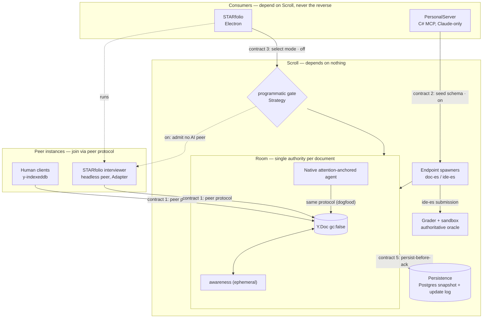
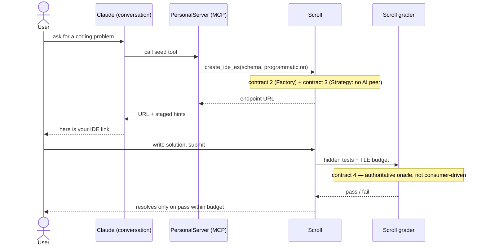
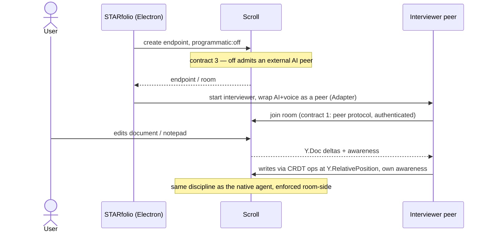

# Sample implementation (illustrative)

Not a decided design. A concrete-enough picture to reason about the contracts and to give a reviewer
something to attack. Edge labels reference the five contracts in [boundaries.md](boundaries.md).

## Structure

Notice the arrows: every consumer arrow points **into** Scroll, and nothing inside Scroll points back
out at a consumer. That is the dependency-direction rule made visual. The interviewer (`IV`) reaches
`Y.Doc` through the same peer-protocol edge a human (`HU`) and the native agent (`NA`) use, and the
programmatic gate is what admits or refuses it.

## Flow: PersonalServer coding problem (programmatic on)

The consumer (PersonalServer) touches exactly one seam (`create_ide_es`) and never the grader. Claude
in conversation is the only intelligence on this path; `programmatic:on` is what guarantees no other
AI joins.

## Flow: STARfolio interview (programmatic off)

STARfolio owns the interviewer intelligence and voice; Scroll owns the room and the protocol. At the
boundary the interviewer is indistinguishable from a human collaborator.
